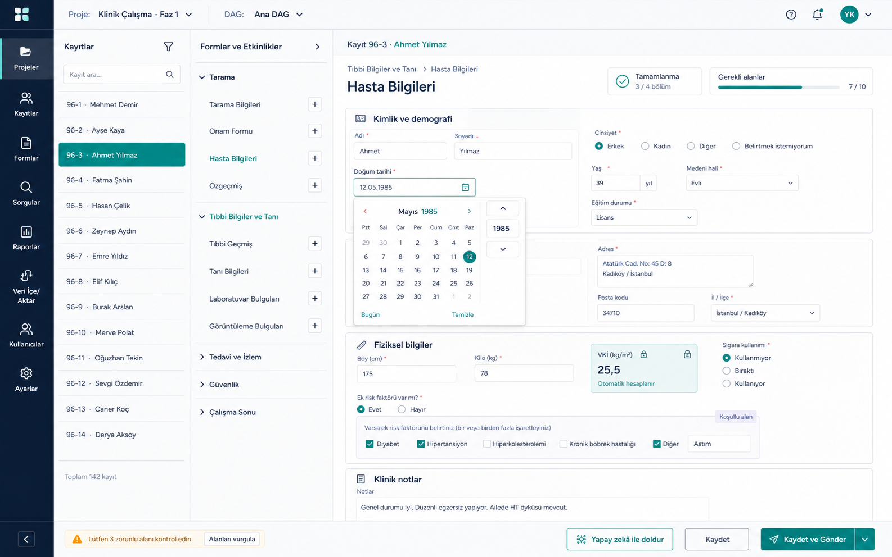

# Veri Giriş Modu Tasarımı

Bu doküman, `0.2.0-early.1` ile ana uygulamaya alınan offline-first REDCap veri giriş modunun mimari ve iş akışı notlarını içerir. Mod; kayıt senkronizasyonu, metadata tabanlı form düzenleme, tekrar eden event/form bağlamları, yerel değişiklik kuyruğu ve REDCap'e gönderim akışını kapsar.

## Hedef İş Akışı

1. Kullanıcı proje bazlı REDCap API token ile bağlanır.
2. Server tarafındaki `tc_hash` external module zorunlu kabul edilir.
3. Uygulama aktif kullanıcı/DAG context bilgisini alır.
4. Kullanıcının erişebildiği kayıtların server manifest'i indirilir.
5. Lokal SQLite cache ile server manifest karşılaştırılır.
6. Server'da daha yeni olan kayıtlar lokale çekilir.
7. Lokalde gönderilmemiş değişiklikler varsa kullanıcıya gösterilir.
8. Kullanıcı formları lokal verilerle açar, manuel veri girer/düzenler.
9. Değişiklikler outbox/pending queue'ya yazılır.
10. Gönderimde conflict kontrolü yapılır; güvenli olanlar REDCap API/external module ile server'a aktarılır.

## Yerel Depolama

İlk teknik tercih SQLite'tır. Nedenleri:

- Büyük REDCap projelerinde JSON dosyalarına göre daha hızlı ve daha kontrollü sorgulanır.
- Kayıt, alan, pending change, sync state ve TC hash eşlemesini ayrı ama ilişkili tablolarda tutabilir.
- İleride form UI, filtreleme, arama ve dynamic query alanları için lokal sorgu altyapısı sağlar.
- Tek dosya olduğu için taşınabilir uygulama modeliyle uyumludur.

İlk şema `data_entry_store.py` içinde oluşturuldu.

Ana tablolar:

- `redcap_data_values`: REDCap'in `redcap_data` tablosuna yakın lokal veri tablosu.
- `redcap_data`: `redcap_data_values` üzerinden view. Dynamic SQL alanları için REDCap'e benzer kolon adları sağlar.
- `record_sync_state`: kayıt bazlı remote/local son değişiklik ve dirty/conflict durumu.
- `pending_changes`: lokalde yapılmış ama server'a gönderilmemiş değişiklikler.
- `identity_hash_map`: serverdaki hashed T.C. kimlik numarası ile `record` eşlemesi.
- `project_context`: proje, kullanıcı ve aktif DAG context cache'i.
- `metadata_cache`: metadata/data dictionary/form/event/choice gibi proje sabitleri.
- `dynamic_query_cache`: serverdan çözümlenmiş dynamic SQL seçenekleri için kısa ömürlü cache.

## REDCap Veri Şekli

REDCap normalde veriyi `redcap_data` tablosunda şu yapıda tutar:

```text
project_id, event_id, record, field_name, value, instance
```

Lokal tablo da bu alanları korur. Ek kolonlar sadece sync için tutulur:

```text
dag_unique_name, remote_updated_at, local_updated_at, source, dirty
```

Bu sayede:

- Form renderer alan değerlerini REDCap'e yakın bir veri modelinden okuyabilir.
- Repeating form/event ve longitudinal yapı sonradan daha doğal desteklenir.
- Basit dynamic SQL alanları lokal `redcap_data` view'ı ile çözümlenebilir.
- Çözülemeyen veya güvenlik/context gerektiren dynamic SQL alanları server endpoint'ine bırakılır.

## T.C. Kimlik Hash Eşlemesi

Server tarafında gerçek T.C. kimlik numarası tutulmamalı veya masaüstüne gönderilmemelidir. External module zaten hashed unique T.C. kimlik numarası ile kayıtları eşleştiriyor. Lokal tarafta tutulacak yapı:

```text
project_id, tc_hash, record, dag_unique_name, remote_updated_at, last_synced_at
```

Bu tablo şu amaçlarla kullanılacak:

- Belge/Excel veya manuel giriş sırasında T.C. hash ile mevcut kayıt bulma.
- Yeni kayıt oluşturma öncesi duplicate kontrolü.
- Offline form ekranında gerçek T.C. numarasını tekrar taşımadan kayıt eşleme.

## Dynamic SQL Alanları

Dynamic Query / SQL alanlarında öncelik lokal çözümleme olmalıdır. REDCap data dictionary içindeki pek çok SQL alanı doğrudan `redcap_data` tablosunu kullanır. Lokal SQLite cache aynı kolonları `redcap_data` view'ı ile sağladığı için bu alanlar server'a gitmeden çözülebilir.

İlk lokal çözümleyici `dynamic_sql.py` içinde oluşturuldu. Desteklenen başlangıç kapsamı:

- Sadece `SELECT` sorguları.
- Sadece `redcap_data` üzerinden okuma.
- `[record-name]` placeholder'ını parametreli sorguya çevirme.
- MySQL `CONCAT(...)` fonksiyonu.
- MySQL `IF(condition, true, false)` fonksiyonu.
- MySQL `GROUP_CONCAT(expr SEPARATOR ' | ')` sözdizimini SQLite `GROUP_CONCAT(expr, ' | ')` biçimine çevirme.
- `CASE WHEN` ifadeleri SQLite tarafından zaten desteklenir.

Bu yaklaşım aşağıdaki örnekleri lokal çalıştırmayı hedefler:

```sql
select value
from redcap_data
where project_id=16
  and field_name='mr_trus_bx_tarihi'
  and record=[record-name]
```

ve `GROUP_CONCAT`, `CONCAT`, `IF`, `CASE WHEN` kullanan MR lezyon seçimi gibi daha karmaşık sorgular.

Server tarafında `get-dynamic-query-options` endpoint'i şimdilik zorunlu değildir. Ancak aşağıdaki durumlarda opsiyonel fallback olarak tekrar değerlendirilebilir:

- SQL `redcap_data` dışındaki REDCap tablolarına ihtiyaç duyarsa.
- REDCap/PHP/MySQL'e özel fonksiyonlar lokal SQLite'a güvenli çevrilemezse.
- Sorgu kullanıcı yetkisi, DAG context veya server-only business rule gerektirirse.
- Dynamic query sonucu server tarafında hesaplanan transient bir değere bağlıysa.

## Gerekli External Module Endpointleri

Mevcut:

- `get-api-user-context`
- `set-api-user-dag`
- `lookup-record-by-tc`
- `create-record-by-tc`

Yeni veri giriş modu için önerilen ek endpointler:

### `get-sync-manifest`

Aktif token/DAG için kullanıcının erişebildiği kayıtların minimal listesini döndürür.

```json
{
  "project_id": "17",
  "dag": "marmara",
  "records": [
    {
      "record": "1",
      "data_access_group_unique_name": "marmara",
      "record_last_modified_at": "2026-05-24 10:12:00",
      "identity_hash_updated_at": "2026-05-24 10:31:00",
      "sync_updated_at": "2026-05-24 10:31:00"
    }
  ],
  "identity_hash_updated_at": "2026-05-24 10:31:00"
}
```

`sync_updated_at`, `record_last_modified_at` ve `identity_hash_updated_at` değerlerinin maksimumu olarak kabul edilir. Lokal conflict kontrolünde kayıt bazlı karşılaştırma zamanı olarak `sync_updated_at` kullanılmalıdır.

### `get-record-data`

Belirli kayıtların `redcap_data` şekline yakın satırlarını döndürür.

Desteklenen parametreler:

- `records`: JSON array string; örnek `["1","2"]`.
- `fields`: JSON array string; örnek `["hasta_ad","hasta_soyad"]`.
- `events`: JSON array string.
- `since`: server tarafında kayıt/değer filtreleme için opsiyonel timestamp.

```json
{
  "project_id": "17",
  "records": [
    {
      "record": "1",
      "record_last_modified_at": "2026-05-24 10:12:00",
      "rows": [
        {
          "project_id": "17",
          "event_id": "",
          "record": "1",
          "field_name": "hasta_ad",
          "value": "AB",
          "instance": ""
        }
      ]
    }
  ]
}
```

### `get-identity-hash-map`

Aktif token/DAG için `tc_hash -> record` eşlemesini döndürür.

```json
{
  "project_id": "17",
  "rows": [
    {
      "record": "1",
      "identity_hash": "...",
      "identity_hash_updated_at": "2026-05-24 10:31:00"
    }
  ]
}
```

### `submit-record-changes`

İlk aşamada mevcut REDCap API import kullanılabilir. Ancak conflict kontrolünü ve server-side validation özetini tek noktadan almak için ileride external module üzerinden batch değişiklik endpoint'i daha iyi olabilir.

## Conflict Mantığı

Her kayıt için iki zaman damgası tutulur:

- `remote_updated_at`: serverdan en son bilinen kayıt değişiklik zamanı.
- `local_updated_at`: lokalde son değişiklik zamanı.

Kurallar:

- Server daha yeni, local dirty değil: kayıt yeniden çekilir.
- Server daha yeni, local dirty: conflict.
- Local dirty, server aynı: kullanıcıya gönderim önerilir.
- İki taraf da aynı: unchanged.

İlk SQLite iskeleti `compare_remote_manifest()` ile bu ayrımı yapmaya başladı.

`DataEntrySyncService.sync_read_only()` ilk çalışan senkronizasyon katmanı olarak
bu mantığı uygular: manifesti alır, yalnızca çekilmesi gereken kayıtlar için
`get-record-data` çağırır, TC hash eşlemesini günceller ve yerelde bekleyen
değişiklik olan kayıtları ezmeden conflict listesine alır.

## Read-Only Kayıt Tarayıcı

`DataEntryRecordBrowser` lokal cache'i UI dostu modellere dönüştürür:

- Kayıt listesi: record id, opsiyonel kullanıcı etiketi, DAG, value/hash sayısı,
  dirty/conflict ve pending change sayısı.
- Arama: record id, alan değerleri ve lokal hash eşlemesi üzerinden.
- Kayıt detayı: metadata verildiğinde form sırasına göre gruplanmış alanlar;
  metadata'da olan ama değeri olmayan alanlar boş/present=false olarak döner.
- Metadata dışında kalan lokal satırlar kaybolmaz, `__unknown__` form bölümünde
  gösterilebilir.

## Metadata Form Renderer İskeleti

`data_entry_form_model.py` REDCap metadata bilgisini renderer modeline çevirir:

- `text`, `notes`, `dropdown`, `radio`, `checkbox`, `yesno`, `truefalse`,
  `calc`, `descriptive` ve `sql` alan tipleri için başlangıç editör türü seçer.
- `choices_options` veya raw choice metninden seçenek listesi oluşturur.
- REDCap checkbox verisinin `field___code` şeklindeki lokal satırlarını tek
  checkbox alanı olarak toparlar.
- `required`, `branching_logic`, `text_validation`, min/max gibi metadata
  bilgilerini UI modeline taşır. Basit REDCap branching logic ifadeleri
  (`and`, `or`, karşılaştırmalar ve checkbox kodları) form ekranında
  değerlendirilmeye başladı; desteklenmeyen karmaşık ifadeler güvenli tarafta
  kalmak için alanı görünür bırakır.

`gui/data_entry_form.py` bu modeli gerçek PySide widget'larına dönüştüren ilk
iskeleti sağlar. Değer toplama `collect_values()` ile REDCap flat payload'a yakın
şekilde yapılır; checkbox alanları `field___code` anahtarları olarak döner.

Form ekranındaki mevcut UI kararları:

- Formlar üstte sıkışan tablar yerine solda okunabilir bir form listesi ve sağda
  aktif form yüzeyi olarak gösterilir.
- Alan satırları `dolu`, `boş`, `zorunlu eksik` ve `bilgi` durumlarını görsel
  olarak ayırır. Bu durumlar değer değiştikçe yeniden hesaplanır.
- Zorunlu eksik alanlar sıcak uyarı rengiyle, dolu alanlar ise onay rengiyle
  ayrılır; durum yalnızca renge bağlı kalmasın diye kısa metin etiketi de
  gösterilir.
- Her formun içinde kendi kaydırma alanı vardır; form dışındaki gereksiz ikinci
  kaydırma katmanı kaldırılmıştır.

## Form Bazlı Yapay Zekâ ile Doldurma

Veri giriş ekranındaki `Yapay zekâ ile doldur` işlevi doğrudan LLM çağrısı
başlatmamalıdır. Doğru akış:

1. Kullanıcı aktif formdayken belgeleri seçer.
2. Ara ekranda sadece o formun doldurulabilir alanları listelenir.
3. Boş alanlar varsayılan seçili, dolu alanlar varsayılan korunur.
4. Kullanıcı alanları tek tek seçip kaldırabilir.
5. Form geneli için kök programdaki ortak kural editörü açılabilir.
6. Seçili alan için aynı ortak kural editörü açılabilir.
7. Ek yönerge, çokluk, seçim kuralı, aday sayısı ve çıktı uzunluğu ayarları
   aynı override payload formatıyla geçici tarama config'ine uygulanır.
8. LLM çağrısı yalnızca seçili alanlar ve geçici form/alan kuralları ile yapılır.

Form bazlı tarama kök belge tarama akışıyla aynı `PatientQueueExtractionWorker`
ve aynı progress/cancel dialog yapısını kullanır. Böylece veri giriş ekranı ayrı
bir LLM tarama mekanizması taşımak yerine mevcut belge tarama altyapısına
bağlanır.

Bu kurallar proje dosyasına kalıcı yazılmaz; ilgili tarama çalışması için
geçici scoped config içine eklenir. Ağ tarafında `connection reset` benzeri
geçici kopmalarda tek kontrollü tekrar denemesi yapılır.

## Tekrarlayan Event/Form Durumu

Lokal veri modeli ve form arayüzü REDCap'in tekrar eden yapılarını bağlamı kaybetmeden işler:

- `redcap_data_values` anahtarı `project_id, event_id, record, field_name,
  instance` kolonlarını içerir.
- `pending_changes` aynı şekilde `event_id` ve `instance` saklar.
- Gönderim payload'ı `instance` varsa `redcap_repeat_instance` yazar ve
  proje konfigürasyonundaki `repeating_forms` bilgisiyle
  `redcap_repeat_instrument` üretebilir.
- Sol gezinmede eventler REDCap metadata sırasıyla ve açılır/kapanır gruplar
  halinde gösterilir.
- Tekrarlanabilir event ve formlar kendi satırlarındaki `+` eylemiyle yeni
  instance oluşturur; ayrı bir alt panel gerektirmez.
- Form ve widget anahtarları `form + event + instance` bağlamını korur; aynı
  alanın farklı tekrarları birbirinin değerini ezmez.
- Form durumları, zorunlu alanların doluluğuna göre hesaplanır ve tekrar
  instance'ları ayrı durum taşır.
- Gönderimde her bağlam ayrı REDCap import satırına dönüştürülür.

`data_entry_form_changes.py` formdan gelen değerleri mevcut form modeliyle
karşılaştırır. Sadece değişen editlenebilir alanlar `pending_changes` kuyruğuna
yazılır; read-only ve descriptive alanlar atlanır. Checkbox alanları REDCap flat
formatına uygun olarak `field___code` değişikliklerine ayrılır.

Lokal görsel deneme ve regresyon önizlemeleri:

```bash
.venv/bin/python scripts/demo_data_entry_form.py
.venv/bin/python scripts/render_clinical_ui.py
.venv/bin/python scripts/render_data_entry_form.py --output build/data-entry-form.png
```

Demo penceresinde bir alanı değiştirip `Queue local changes` düğmesine basarak
lokal pending queue davranışı görülebilir.

Uygulanan form görsel yönünün ImageGen referansı:



## Geliştirme Sırası

1. SQLite şema ve store testleri.
2. External module sync client endpoint parserları.
3. İlk proje açılışında read-only sync: manifest + changed records + identity hash map.
4. Read-only kayıt tarayıcı.
5. REDCap metadata'dan form renderer.
6. Manual edit -> pending changes.
7. Submit + conflict resolver.
8. Dynamic SQL seçenek çözümleyicisini gerçek proje SQL örnekleriyle genişletme.
